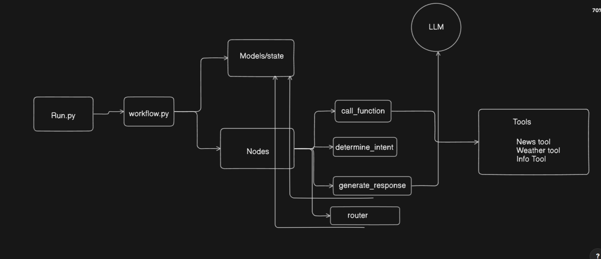

# 🤖 LangGraph AI Agentic System:

This project is a **modular LangGraph-based agentic system** built with [LangChain](https://github.com/langchain-ai/langchain), [LangGraph](https://github.com/langchain-ai/langgraph), and Azure OpenAI . 

---

## 🚀 Purpose

The goal of this project is to demonstrate how **AI agents** can be combined with **external tools** and orchestrated using **LangGraph's workflow-based graph**. Specifically, it:
- The following projects involves conditional wokflows with LangGraph
- It includes two tool -- **Weather Tool** and **News tool** and they work conditionally
- Either of the one is triggered according to the intent of the **Human Response**
- Makes use of **LangChain's agentic tooling** and **LangGraph's conditional flows**

---

### Setup


Clone the repository
```bash
git clone https://github.com/uchiha-vivek/Langgraph-Template.git
```

Navigate to the directory
```bash
cd Langgraph-Template
```

Make virtual environment (Here for Windows)
```bash
python -m venv venv
```

Activate the virtual environment
```bash
venv\Scripts\activate
```

Install the dependencies
```bash
pip install -r requirements.txt
```

Run command
```bash
python main.py
```


 

 
 
Contributor :  Vivek Sharma --(Founding AI Engineer @ Ally Solutions) 
